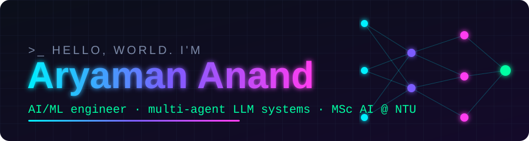
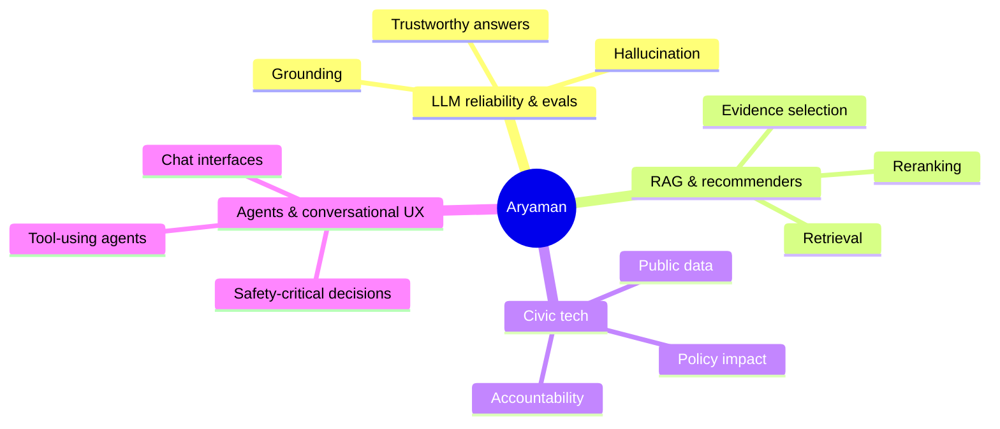

 

---

## 👋 Who I am

**AI/ML engineer building multi-agent LLM systems and voice pipelines.** I'm doing an **MSc in Artificial Intelligence at NTU Singapore (CCDS)**, started August 2026, and I'm working toward a Singapore internship and a full-time AI/ML role.

Before that I spent **~16 months at Hotelzify** building production LLM systems for hospitality. I built a multilingual voice concierge, a multi-agent architecture live across **250+ hotel properties in 5 countries**, handling guest queries end to end in the guest's own language. Earlier: AI/ML engineering at **HyperVerge**.

I care less about leaderboard numbers and more about whether a system can be **trusted**: it grounds its answers, admits what it doesn't know, and holds up when the inputs get messy. My north star is simple: **use AI to solve problems that matter to people.**

---

## 🚀 What I'm working on right now

<table>
<tr>
<td width="50%" valign="top">

### 🇮🇳 Make India Accountable
A long-term civic accountability platform. The idea is to make public promises, spending and outcomes **legible and checkable** by anyone, so accountability stops depending on who shouts loudest.

`civic-tech` `public-data` `transparency`

</td>
<td width="50%" valign="top">

### ✈️ SENTINEL: Autonomous ATC
A browser-based demo of an **automated London TMA** (Heathrow plus its four real holding stacks). Automation runs the routine work of a terminal sector: predicting conflicts about 2 minutes ahead, sequencing arrivals by wake category, handling handoffs and speaking ICAO clearances. Humans are pulled in only for the **critical few**, with a recommended action to Execute or Override.

`agents` `planning` `safety-critical`

</td>
</tr>
<tr>
<td colspan="2" valign="top">

### 🔭 Always scouting
I'm actively looking for **more areas where technology and AI can genuinely help humanity**, in the public sector, safety-critical systems and anywhere people are underserved by their tools. If you know one, I want to hear about it.

</td>
</tr>
</table>

<b>🧪 Recent builds &amp; collaborations</b>

 

| Project | What it is | My part |
|---|---|---|
| **ShieldCall** | AI-powered real-time phone call detection and shielding system (Python) | Creator |
| **promptryt** | AI prompt co-pilot for ChatGPT, Claude, Gemini, Copilot, DeepSeek and Manus; generates Direct, Well Rounded and Technical prompt variants, no account needed (JavaScript) | Creator |
| **Needle** (TechJam 2026, Track 4) | Conversational storefront and retrieval-driven recommender for a hackathon challenge | Semantic robustness research, independent result reproduction, robustness harness |
| **SENTINEL** | Autonomous air traffic control demo on a live radar canvas: STCA conflict prediction, arrival sequencing, holding stacks, emergencies, voice R/T | Sole builder (10 JS modules, real flight physics) |
| **Breast-cancer classifier** | SVM + MLP on WDBC with EER and ROC analysis | Full pipeline and evaluation |

---

## 🧭 What kind of work excites me

- **🧠 LLM reliability & evals.** How do we *measure* whether a model is telling the truth, and how do we make it say "I don't know"?
- **🔎 RAG & recommender systems.** Getting the right evidence in front of the model and the right item in front of the user.
- **🏛️ Civic tech & accountability.** Using data and software to make institutions more transparent.
- **🤖 Agents & conversational UX.** Systems that act, and interfaces that feel natural to use.

**The common thread:** systems where being *right and verifiable* matters more than being impressive.

---

## 🛠️ Toolbox

<b>Background</b>

 

**Education**
MSc Artificial Intelligence, Nanyang Technological University, Singapore. 2026 to 2027.
B.Tech Computer Science and Engineering, VIT Vellore.

**Experience**
Hotelzify: multi-agent LLM systems, multilingual voice concierge (250+ hotels, 5 countries). ~16 months.
HyperVerge: AI/ML engineering.

**Based in** Singapore. From India.

---

## 🐍 Contribution snake

---

## 💬 Let's build something

I'm happy to talk about LLM evals, retrieval, civic tech, or a problem you think AI *should* be solving.

<code>while alive: build(); learn(); ship()</code>

